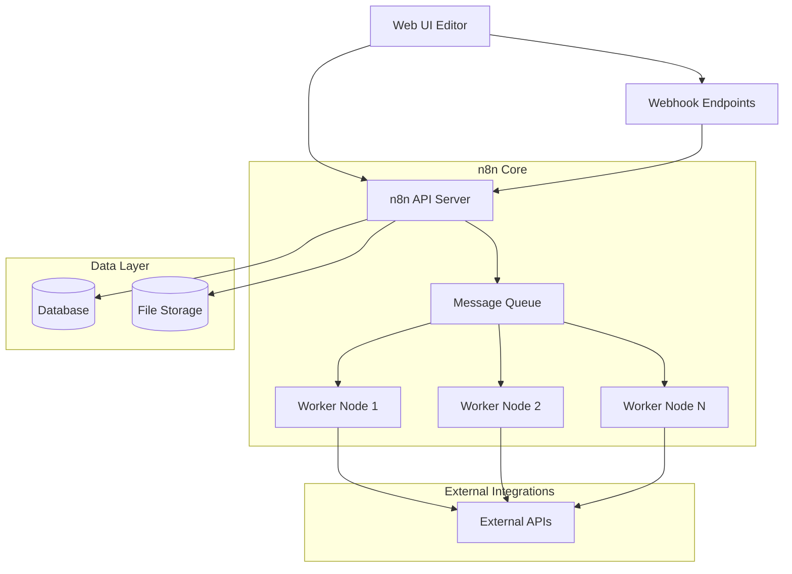
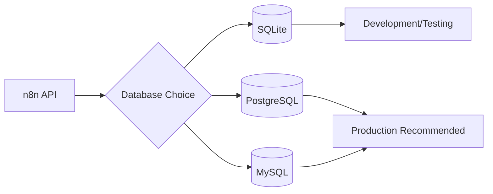
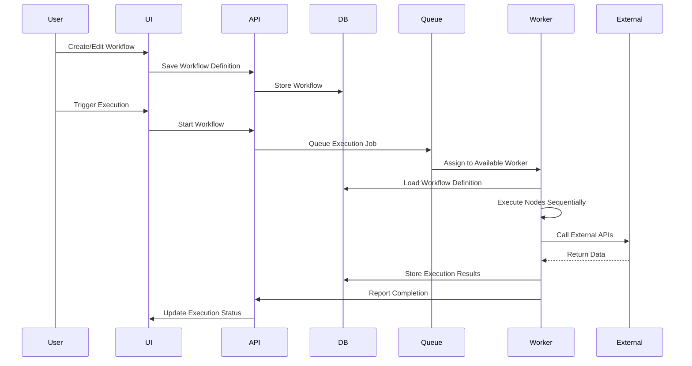
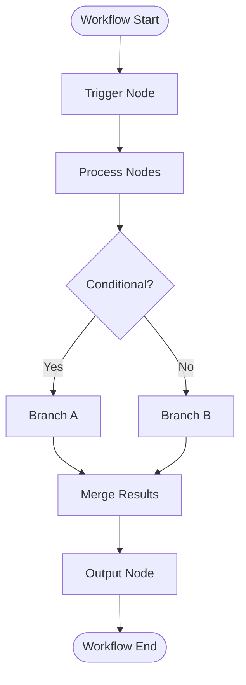
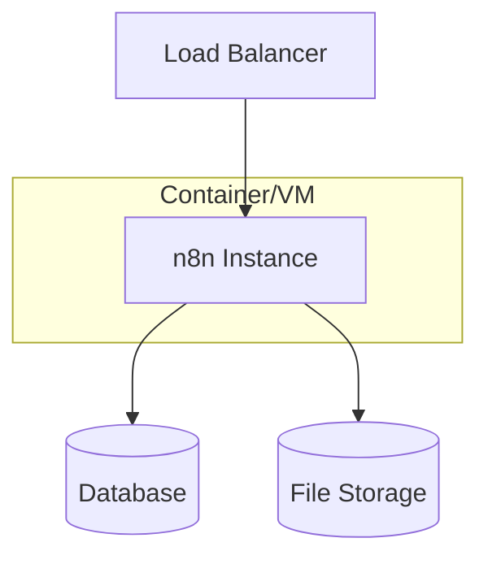
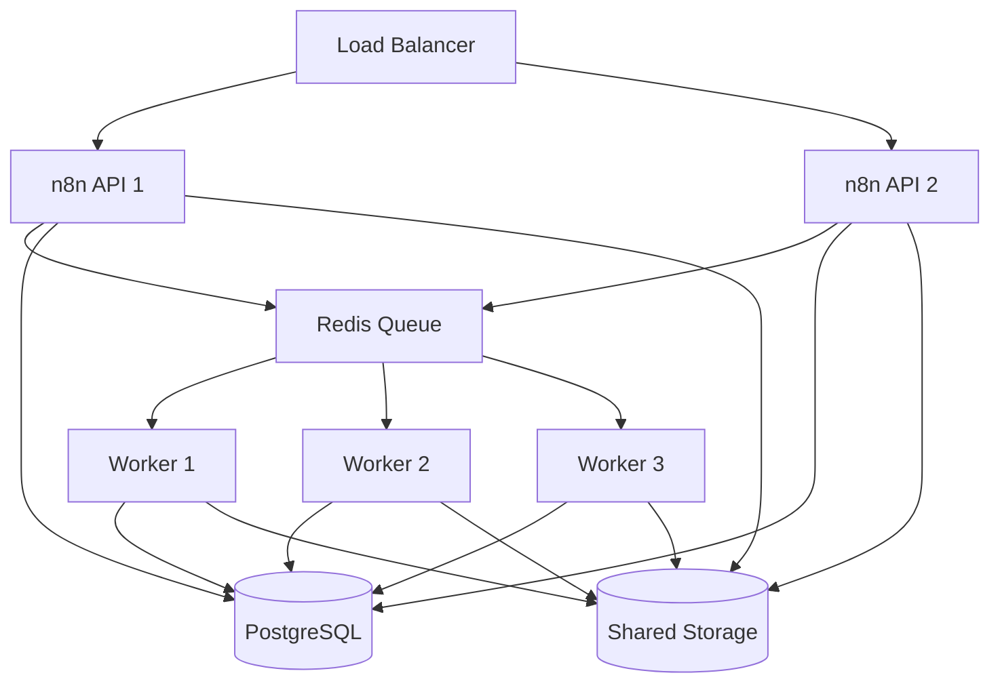
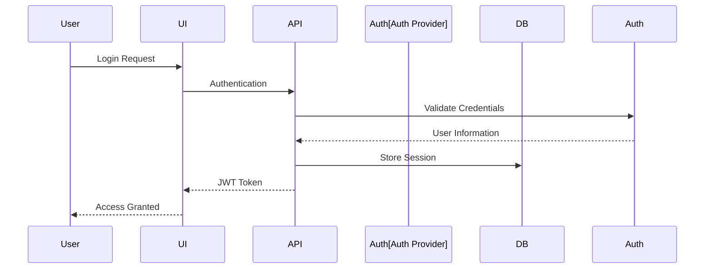

# Architecture

This document outlines the technical architecture of the n8n workflow automation application, including system components, data flow, and deployment patterns used in our infrastructure.

## System Overview

n8n follows a modular architecture designed for scalability and extensibility. The system consists of several key components that work together to provide workflow automation capabilities.

## Core Components

### Web UI Editor
- **Purpose**: Visual workflow designer and management interface
- **Technology**: Vue.js single-page application
- **Access**: Browser-based, responsive design
- **Features**: Drag-and-drop workflow building, real-time collaboration, execution monitoring

### API Server
- **Purpose**: Central orchestration and workflow management
- **Technology**: Node.js with Express.js framework
- **Responsibilities**:
  - Workflow definition storage and retrieval
  - User authentication and authorization
  - Webhook endpoint management
  - Execution scheduling and monitoring
  - Node.js plugin system for integrations

### Database Layer
Production deployments support multiple database backends:

**Database Schema**:
- **Workflows**: Workflow definitions, versions, and metadata
- **Executions**: Execution history, status, and results
- **Users**: User accounts, permissions, and settings
- **Credentials**: Encrypted connection credentials for external services

### Message Queue System
For scalable execution, n8n can utilize queue-based processing:

- **Queue Types**: Redis-based job queues for distributed processing
- **Worker Scaling**: Horizontal scaling of execution workers
- **Job Distribution**: Automatic load balancing across available workers

## Data Flow Architecture

## Node.js Architecture

n8n's extensibility comes from its node-based architecture:

### Node Types
- **Trigger Nodes**: Initiate workflows (webhooks, schedules, manual triggers)
- **Regular Nodes**: Process data and call external services
- **Output Nodes**: Handle workflow results and notifications

### Node Execution Flow

## Deployment Architecture

### Single Instance Deployment
Suitable for development and small-scale production:

### Scaled Deployment
For high-availability production environments:

## Security Architecture

### Authentication Flow

### Authorization Model
- **User-based**: Individual user accounts with role assignments
- **Workspace-based**: Team collaboration with shared workflows
- **Credential Management**: Encrypted storage of external service credentials

## Performance Considerations

### Scaling Strategies
1. **Vertical Scaling**: Increase CPU/memory for single instance
2. **Horizontal Scaling**: Add worker nodes for execution parallelism
3. **Database Optimization**: Connection pooling, indexing, read replicas
4. **Caching**: Redis for session storage and temporary data

### Resource Requirements
- **Minimum**: 1 CPU core, 2GB RAM for basic workloads
- **Production**: 2+ CPU cores, 4GB+ RAM, SSD storage
- **High-scale**: Dedicated worker nodes, load balancing, database clustering

## Seams

For detailed architectural information, refer to official sources:

- [n8n Architecture Overview](https://docs.n8n.io/contributing/architecture/) — Official architecture documentation
- [n8n Source Code](https://github.com/n8n-io/n8n) — Implementation details and technical discussions
- [n8n Deployment Guide](https://docs.n8n.io/hosting/installation/) — Infrastructure patterns and best practices
- [n8n Scaling Guide](https://docs.n8n.io/hosting/scaling/) — Performance optimization and scaling strategies

## Source Map

| Title | URL | Publisher | Last_Updated | Date_Accessed |
|-------|-----|-----------|--------------|---------------|
| n8n Architecture Overview | https://docs.n8n.io/contributing/architecture/ | n8n GmbH | 2024-08-15 | 2024-09-17 |
| n8n Source Code Repository | https://github.com/n8n-io/n8n | n8n GmbH | 2024-09-16 | 2024-09-17 |
| n8n Installation Guide | https://docs.n8n.io/hosting/installation/ | n8n GmbH | 2024-08-20 | 2024-09-17 |
| n8n Scaling Documentation | https://docs.n8n.io/hosting/scaling/ | n8n GmbH | 2024-07-30 | 2024-09-17 |
| n8n Database Configuration | https://docs.n8n.io/hosting/configuration/database/ | n8n GmbH | 2024-08-10 | 2024-09-17 |

**Last reviewed**: 2024-09-17