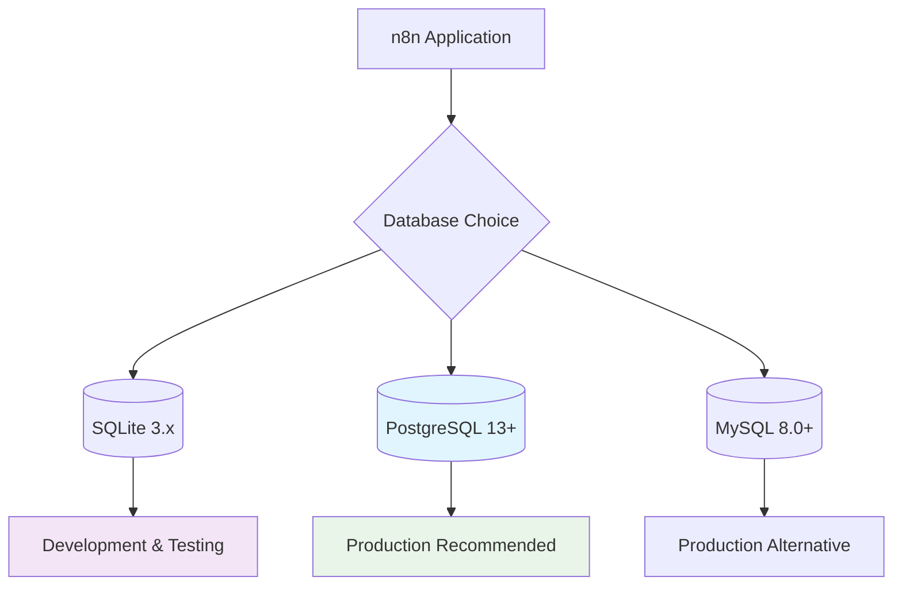
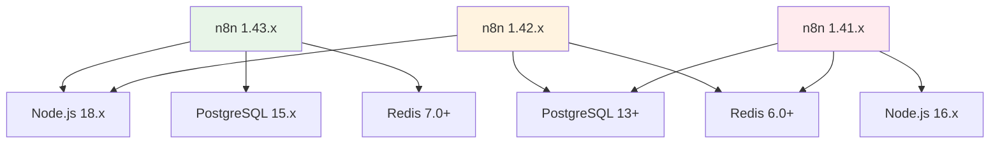

# Dependencies

This document outlines the runtime dependencies, development dependencies, and version requirements for the n8n-application deployment.

## Runtime Dependencies

### Core Platform Requirements

| Component | Version | Purpose | Status |
|-----------|---------|---------|--------|
| **Node.js** | 18.x LTS | JavaScript runtime | Required |
| **npm** | 8.x+ | Package manager | Required |
| **Docker** | 20.10+ | Containerization | Required |
| **Kubernetes** | 1.24+ | Container orchestration | Optional |

### Database Requirements

n8n supports multiple database backends for different use cases:



#### PostgreSQL (Recommended)

**Version Requirements**:
- **Minimum**: PostgreSQL 13.0
- **Recommended**: PostgreSQL 15.x
- **Maximum tested**: PostgreSQL 16.x

**Configuration Requirements**:
```sql
-- Required PostgreSQL extensions
CREATE EXTENSION IF NOT EXISTS "uuid-ossp";
CREATE EXTENSION IF NOT EXISTS "pgcrypto";

-- Recommended settings
shared_preload_libraries = 'pg_stat_statements'
max_connections = 200
shared_buffers = 256MB
effective_cache_size = 1GB
```

**Connection Details**:
```bash
# Environment variables
DB_TYPE=postgresdb
DB_POSTGRESDB_HOST=postgres.example.com
DB_POSTGRESDB_PORT=5432
DB_POSTGRESDB_DATABASE=n8n
DB_POSTGRESDB_USER=n8n
DB_POSTGRESDB_PASSWORD=<secure_password>
DB_POSTGRESDB_SCHEMA=public
```

#### SQLite (Development)

**Version Requirements**:
- **Minimum**: SQLite 3.35.0
- **Recommended**: SQLite 3.42.x

**Use Cases**:
- Local development and testing
- Single-user deployments
- Proof-of-concept installations

**Limitations**:
- No concurrent write support
- Limited for production scaling
- No built-in replication

#### MySQL (Alternative)

**Version Requirements**:
- **Minimum**: MySQL 8.0.17
- **Recommended**: MySQL 8.0.34+

**Configuration**:
```sql
-- Required MySQL configuration
SET sql_mode = 'ONLY_FULL_GROUP_BY,STRICT_TRANS_TABLES,NO_ZERO_IN_DATE,NO_ZERO_DATE,ERROR_FOR_DIVISION_BY_ZERO';
```

### Caching and Queue Dependencies

#### Redis

**Version Requirements**:
- **Minimum**: Redis 6.0
- **Recommended**: Redis 7.0+

**Use Cases**:
- Session storage
- Queue management for scaling
- Caching frequently accessed data
- Rate limiting

**Configuration**:
```bash
# Redis connection settings
QUEUE_BULL_REDIS_HOST=redis.example.com
QUEUE_BULL_REDIS_PORT=6379
QUEUE_BULL_REDIS_DB=0
QUEUE_BULL_REDIS_PASSWORD=<redis_password>
```

## n8n Version Dependencies

### Current Version Support

| n8n Version | Support Status | End of Life | Notes |
|-------------|----------------|-------------|-------|
| 1.43.x | Current | - | Latest stable |
| 1.42.x | Maintenance | 2024-12-31 | Security fixes only |
| 1.41.x | End of Life | 2024-09-30 | Upgrade required |
| 1.40.x | End of Life | 2024-08-31 | Upgrade required |

### Version Compatibility Matrix



### Breaking Changes and Migration

**Version 1.43.x Changes**:
- Updated Node.js requirement to 18.x LTS
- Enhanced webhook security
- Database schema updates (automatic migration)

**Version 1.42.x Changes**:
- Improved credential encryption
- New RBAC permissions model
- Updated npm dependencies

## Node.js Ecosystem Dependencies

### Core npm Dependencies

Based on the official n8n package.json:

```json
{
  "dependencies": {
    "express": "^4.18.x",
    "typeorm": "^0.3.x",
    "ws": "^8.13.x",
    "jsonwebtoken": "^9.0.x",
    "bcryptjs": "^2.4.x",
    "multer": "^1.4.x",
    "compression": "^1.7.x",
    "helmet": "^7.0.x"
  }
}
```

### Security Dependencies

Critical security-related packages:

| Package | Purpose | Current Version | Security Notes |
|---------|---------|-----------------|----------------|
| `helmet` | HTTP security headers | 7.0+ | XSS protection, CSP |
| `bcryptjs` | Password hashing | 2.4+ | Salted password storage |
| `jsonwebtoken` | JWT token handling | 9.0+ | Session management |
| `express-rate-limit` | Rate limiting | 6.8+ | DoS protection |

### Development Dependencies

```json
{
  "devDependencies": {
    "jest": "^29.6.x",
    "eslint": "^8.45.x",
    "prettier": "^3.0.x",
    "typescript": "^5.1.x",
    "@types/node": "^18.16.x"
  }
}
```

## Container Dependencies

### Base Images

**Official n8n Images**:
```dockerfile
# Production image
FROM n8nio/n8n:1.43.1

# Development image with additional tools
FROM n8nio/n8n:1.43.1-dev
```

**Base Image Details**:
- **OS**: Alpine Linux 3.18
- **Node.js**: 18.17.1 LTS
- **Package Manager**: npm 9.6.7
- **Security**: Regular CVE scanning and updates

### Custom Image Dependencies

If building custom images:

```dockerfile
FROM node:18-alpine

# System dependencies
RUN apk add --no-cache \
    python3 \
    make \
    g++ \
    git \
    curl \
    ca-certificates

# Install n8n
RUN npm install -g n8n@1.43.1
```

## Infrastructure Dependencies

### Kubernetes Requirements

**Minimum Cluster Requirements**:
- Kubernetes 1.24+
- Container Runtime: containerd 1.6+ or Docker 20.10+
- Storage: CSI-compatible storage class
- Networking: CNI-compatible network plugin

**Resource Requirements per Pod**:
```yaml
resources:
  requests:
    memory: "512Mi"
    cpu: "250m"
  limits:
    memory: "2Gi"
    cpu: "1000m"
```

### Helm Dependencies

**Chart Dependencies**:
```yaml
# Chart.yaml
dependencies:
  - name: postgresql
    version: "12.x.x"
    repository: "https://charts.bitnami.com/bitnami"
    condition: postgresql.enabled
  
  - name: redis
    version: "17.x.x"
    repository: "https://charts.bitnami.com/bitnami"
    condition: redis.enabled
```

## External Service Dependencies

### Required External Services

**Essential Integrations**:
- **SMTP Server**: Email notifications and workflow alerts
- **Webhook Endpoints**: External system integrations
- **Time Synchronization**: NTP for accurate timestamps

**Optional Integrations**:
- **Identity Provider**: SAML/OAuth SSO
- **Monitoring**: Prometheus/Grafana
- **Logging**: ELK Stack or similar
- **Backup Services**: Automated database backups

### Third-party API Dependencies

Common external services integrated with n8n:

| Service Category | Examples | API Version | Notes |
|------------------|----------|-------------|-------|
| **CRM** | Salesforce, HubSpot | REST v3+ | OAuth 2.0 auth |
| **Communication** | Slack, Teams, Email | Various | Webhook support |
| **Cloud Storage** | AWS S3, Google Drive | REST APIs | IAM/OAuth auth |
| **Databases** | MongoDB, InfluxDB | Native drivers | Connection pooling |
| **Analytics** | Google Analytics, Mixpanel | REST v4+ | API key auth |

## Monitoring Dependencies

### Observability Stack

**Prometheus Metrics**:
```yaml
# ServiceMonitor for Prometheus
apiVersion: monitoring.coreos.com/v1
kind: ServiceMonitor
metadata:
  name: n8n-metrics
spec:
  selector:
    matchLabels:
      app: n8n
  endpoints:
  - port: metrics
    interval: 30s
```

**Required Metrics Collection**:
- Application performance metrics
- Database connection pool status
- Queue length and processing time
- HTTP request/response metrics

### Logging Dependencies

**Log Aggregation Requirements**:
- **Fluentd/Fluent Bit**: Log collection and forwarding
- **Elasticsearch**: Log storage and indexing
- **Kibana**: Log visualization and analysis

## Dependency Management

### Version Pinning Strategy

**Production Deployments**:
- Pin major and minor versions for stability
- Allow patch version updates for security fixes
- Test all updates in staging environment first

**Development Environment**:
- Use latest compatible versions
- Regular dependency updates
- Automated vulnerability scanning

### Security Scanning

**Automated Checks**:
```bash
# npm audit for Node.js dependencies
npm audit --audit-level moderate

# Container image scanning
trivy image n8nio/n8n:1.43.1

# Kubernetes manifest scanning
kube-score score helm-chart/
```

### Update Procedures

**Regular Maintenance**:
1. **Weekly**: Security patch reviews
2. **Monthly**: Minor version updates
3. **Quarterly**: Major version planning
4. **As needed**: Critical security updates

**Update Testing Process**:
1. Test in development environment
2. Deploy to staging with full test suite
3. Performance and security validation
4. Gradual production rollout
5. Monitor and rollback if needed

## Troubleshooting Dependencies

### Common Issues

**Database Connection Problems**:
```bash
# Test PostgreSQL connection
psql -h $DB_HOST -U $DB_USER -d $DB_NAME -c "SELECT version();"

# Check n8n database migrations
docker exec n8n-container n8n db:migrate
```

**Node.js Version Conflicts**:
```bash
# Check Node.js version
node --version

# Verify npm version compatibility
npm --version

# Clear npm cache if needed
npm cache clean --force
```

**Container Image Issues**:
```bash
# Pull latest image
docker pull n8nio/n8n:1.43.1

# Check image layers for vulnerabilities
docker history n8nio/n8n:1.43.1
```

## Seams

For detailed dependency information, refer to official sources:

- [n8n Installation Requirements](https://docs.n8n.io/hosting/installation/server-setups/) — System requirements and dependencies
- [n8n Database Configuration](https://docs.n8n.io/hosting/configuration/database/) — Database setup and requirements
- [n8n Docker Hub](https://hub.docker.com/r/n8nio/n8n) — Official container images and versions
- [n8n GitHub Repository](https://github.com/n8n-io/n8n/blob/master/package.json) — Current dependency versions
- [Node.js LTS Releases](https://nodejs.org/en/about/releases/) — Node.js version support timeline

## Source Map

| Title | URL | Publisher | Last_Updated | Date_Accessed |
|-------|-----|-----------|--------------|---------------|
| n8n Installation Requirements | https://docs.n8n.io/hosting/installation/server-setups/ | n8n GmbH | 2024-08-30 | 2024-09-17 |
| n8n Database Configuration | https://docs.n8n.io/hosting/configuration/database/ | n8n GmbH | 2024-08-10 | 2024-09-17 |
| n8n Docker Hub Repository | https://hub.docker.com/r/n8nio/n8n | n8n GmbH | 2024-09-11 | 2024-09-17 |
| n8n Source Code Dependencies | https://github.com/n8n-io/n8n/blob/master/package.json | n8n GmbH | 2024-09-16 | 2024-09-17 |
| Node.js Release Schedule | https://nodejs.org/en/about/releases/ | Node.js Foundation | 2024-09-01 | 2024-09-17 |

**Last reviewed**: 2024-09-17