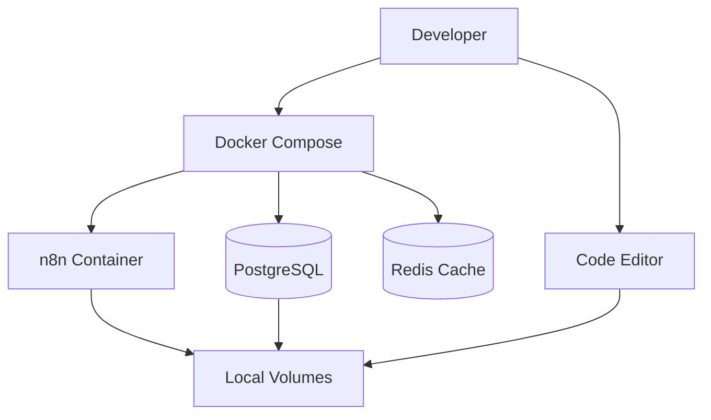

# Development

This guide covers local development setup, testing procedures, and contribution guidelines for the n8n-application project.

## Prerequisites

### Required Software

| Tool | Version | Purpose |
|------|---------|---------|
| Node.js | 18.x LTS | Runtime environment |
| Docker | 20.10+ | Containerization and local development |
| Docker Compose | 2.0+ | Multi-service orchestration |
| Make | 3.8+ | Build automation |
| Git | 2.30+ | Version control |

### Optional Tools

| Tool | Purpose |
|------|---------|
| kubectl | Kubernetes cluster interaction |
| Helm | Kubernetes package management |
| age/sops | Secrets encryption/decryption |

## Local Development Setup

### Quick Start

1. **Clone the repository**:
   ```bash
   git clone https://github.com/webgrip/n8n-application.git
   cd n8n-application
   ```

2. **Start the development environment**:
   ```bash
   # Start all services
   docker compose up --build
   
   # Access n8n at http://localhost:5678
   ```

3. **Stop the environment**:
   ```bash
   docker compose down --remove-orphans --volumes
   ```

### Environment Configuration

#### Environment Variables

Copy the example environment file and customize:

```bash
cp .env.example .env
```

Key development variables:

```bash
# Basic configuration
N8N_HOST=localhost
N8N_PORT=5678
N8N_PROTOCOL=http

# Database (SQLite for development)
DB_TYPE=sqlite
DB_SQLITE_DATABASE=/home/node/.n8n/database.sqlite

# Development features
N8N_LOG_LEVEL=debug
N8N_METRICS=true
```

#### Secrets Management

For development with encrypted secrets:

```bash
# Initialize encryption
make secrets:init

# Add secrets to plaintext file
echo "database_password: dev_password" > ops/secrets/n8n-secrets/values.dec.yaml

# Encrypt secrets
make secrets:encrypt SECRETS_DIR=./ops/secrets/n8n-secrets
```

### Docker Development Workflow

Our Docker Compose setup provides:



**Services provided**:
- **n8n**: Main application with hot-reload
- **PostgreSQL**: Production-like database
- **Redis**: Caching and queue services
- **Adminer**: Database administration UI

### Alternative: Native Development

For developers preferring native Node.js development:

```bash
# Install dependencies
npm install

# Set up environment
export DB_TYPE=sqlite
export N8N_HOST=localhost
export N8N_PORT=5678

# Start PostgreSQL (if using)
docker run -d --name postgres \
  -e POSTGRES_DB=n8n \
  -e POSTGRES_USER=n8n \
  -e POSTGRES_PASSWORD=n8n \
  -p 5432:5432 \
  postgres:13

# Start n8n
npm start
```

## Development Workflows

### Feature Development

1. **Create feature branch**:
   ```bash
   git checkout -b feature/workflow-improvements
   ```

2. **Develop with live reload**:
   ```bash
   # Start development environment
   docker compose up

   # Make changes to configuration files
   # n8n will automatically reload
   ```

3. **Test changes**:
   ```bash
   # Run tests
   make test

   # Test specific workflows
   curl http://localhost:5678/healthz
   ```

4. **Commit with conventional commits**:
   ```bash
   git add .
   git commit -m "feat: add new webhook integration configuration"
   ```

### Configuration Changes

**Helm Chart Modifications**:
```bash
# Validate Helm chart
helm lint ./ops/helm/n8n

# Test deployment (dry-run)
helm install --dry-run --debug n8n-test ./ops/helm/n8n
```

**Docker Configuration**:
```bash
# Build and test custom images
docker build -t n8n-local ./ops/docker/n8n
docker run --rm -p 5678:5678 n8n-local
```

## Testing

### Test Categories

Following our structured test approach:

```
tests/
├── unit/           # Isolated component tests
├── integration/    # Multi-component interaction tests
├── functional/     # End-to-end application functionality
├── contract/       # API contract validation
├── e2e/           # Browser-based user workflow tests
├── smoke/         # Basic functionality verification
├── performance/   # Load and performance testing
├── manual/        # Manual test procedures and tools
└── behavioral/    # BDD-style behavior tests
```

### Running Tests

**Unit Tests**:
```bash
# Run all unit tests
npm run test:unit

# Run specific test file
npm run test:unit -- tests/unit/config.test.js
```

**Integration Tests**:
```bash
# Start test environment
docker compose -f docker-compose.test.yml up -d

# Run integration tests
npm run test:integration

# Cleanup
docker compose -f docker-compose.test.yml down
```

**End-to-End Tests**:
```bash
# Install Playwright browsers
npx playwright install

# Run E2E tests
npm run test:e2e

# Run in headed mode for debugging
npm run test:e2e -- --headed
```

**Smoke Tests**:
```bash
# Quick validation of core functionality
npm run test:smoke

# Test specific endpoints
curl -f http://localhost:5678/healthz || exit 1
```

### Test Development

**Writing Unit Tests**:
```javascript
// tests/unit/config.test.js
describe('Configuration Loading', () => {
  test('should load default configuration', () => {
    const config = loadConfig();
    expect(config.port).toBe(5678);
  });
  
  test('should override with environment variables', () => {
    process.env.N8N_PORT = '8080';
    const config = loadConfig();
    expect(config.port).toBe(8080);
  });
});
```

**Writing Integration Tests**:
```javascript
// tests/integration/api.test.js
describe('API Integration', () => {
  beforeAll(async () => {
    await startTestEnvironment();
  });
  
  test('should authenticate and return workflows', async () => {
    const response = await request(app)
      .get('/api/v1/workflows')
      .set('Authorization', 'Bearer test-token');
    
    expect(response.status).toBe(200);
    expect(response.body).toHaveProperty('data');
  });
});
```

## Code Quality

### Linting and Formatting

We use ESLint and Prettier for code consistency:

```bash
# Run linting
npm run lint

# Fix automatically fixable issues
npm run lint:fix

# Format code
npm run format
```

### Pre-commit Hooks

Automated quality checks before commits:

```bash
# Install pre-commit hooks
npm run prepare

# Hooks will run automatically on commit
git commit -m "feat: add new feature"
```

### Code Coverage

Monitor test coverage:

```bash
# Generate coverage report
npm run test:coverage

# View HTML report
open coverage/lcov-report/index.html
```

Target: **≥90% test coverage** for core functionality.

## Debugging

### Application Debugging

**Docker Environment**:
```bash
# View logs
docker compose logs -f n8n

# Enter running container
docker compose exec n8n /bin/sh

# Debug with specific log level
docker compose up --build -e N8N_LOG_LEVEL=debug
```

**Native Development**:
```bash
# Start with Node.js debugger
node --inspect=0.0.0.0:9229 node_modules/.bin/n8n start

# Connect with Chrome DevTools
# Open chrome://inspect in Chrome browser
```

### Database Debugging

**View database contents**:
```bash
# Access Adminer (if using Docker Compose)
open http://localhost:8080

# Or connect directly to PostgreSQL
docker compose exec postgres psql -U n8n -d n8n
```

**Common database queries**:
```sql
-- View workflows
SELECT id, name, active FROM workflow_entity;

-- View recent executions
SELECT id, workflow_id, mode, status, started_at 
FROM execution_entity 
ORDER BY started_at DESC 
LIMIT 10;
```

## Contributing

### Contribution Process

1. **Check existing issues and discussions**
2. **Create feature branch from main**
3. **Implement changes with tests**
4. **Ensure all quality checks pass**
5. **Create pull request with description**
6. **Address review feedback**
7. **Merge after approval**

### Commit Message Format

We use [Conventional Commits](https://www.conventionalcommits.org/):

```bash
<type>[optional scope]: <description>

[optional body]

[optional footer(s)]
```

**Types**: `feat`, `fix`, `docs`, `style`, `refactor`, `test`, `chore`

**Examples**:
```bash
feat(auth): add SAML authentication support
fix(api): resolve workflow execution timeout issue
docs: update development setup instructions
test: add integration tests for webhook handling
```

### Pull Request Guidelines

**PR Title**: Use conventional commit format
**Description**: Include:
- Summary of changes
- Related issue numbers
- Testing instructions
- Breaking changes (if any)

**Checklist**:
- [ ] Tests pass locally
- [ ] Code coverage maintained
- [ ] Documentation updated
- [ ] CHANGELOG updated (if needed)
- [ ] No breaking changes (or properly documented)

## Performance Profiling

### Application Performance

**Node.js Profiling**:
```bash
# Generate CPU profile
node --prof node_modules/.bin/n8n start

# Process profile data
node --prof-process isolate-*.log > processed.txt
```

**Memory Analysis**:
```bash
# Heap snapshot
node --inspect node_modules/.bin/n8n start
# Connect Chrome DevTools and take heap snapshots
```

### Database Performance

**Query Analysis**:
```sql
-- Enable query logging (PostgreSQL)
ALTER SYSTEM SET log_statement = 'all';
SELECT pg_reload_conf();

-- View slow queries
SELECT query, mean_time, calls 
FROM pg_stat_statements 
ORDER BY mean_time DESC 
LIMIT 10;
```

## Seams

For detailed development information, refer to official resources:

- [n8n Development Guide](https://docs.n8n.io/contributing/development/) — Official development setup and guidelines
- [n8n Contributing Guidelines](https://github.com/n8n-io/n8n/blob/master/CONTRIBUTING.md) — Contribution process and standards
- [n8n Source Code](https://github.com/n8n-io/n8n) — Complete source code and examples
- [Node.js Development](https://nodejs.org/en/docs/guides/) — Node.js best practices and debugging
- [Docker Development](https://docs.docker.com/develop/) — Docker development workflows

## Source Map

| Title | URL | Publisher | Last_Updated | Date_Accessed |
|-------|-----|-----------|--------------|---------------|
| n8n Development Guide | https://docs.n8n.io/contributing/development/ | n8n GmbH | 2024-08-10 | 2024-09-17 |
| n8n Contributing Guidelines | https://github.com/n8n-io/n8n/blob/master/CONTRIBUTING.md | n8n GmbH | 2024-07-20 | 2024-09-17 |
| n8n Source Repository | https://github.com/n8n-io/n8n | n8n GmbH | 2024-09-16 | 2024-09-17 |
| Node.js Debugging Guide | https://nodejs.org/en/docs/guides/debugging-getting-started/ | Node.js Foundation | 2024-08-01 | 2024-09-17 |
| Docker Development Best Practices | https://docs.docker.com/develop/dev-best-practices/ | Docker Inc | 2024-07-15 | 2024-09-17 |

**Last reviewed**: 2024-09-17