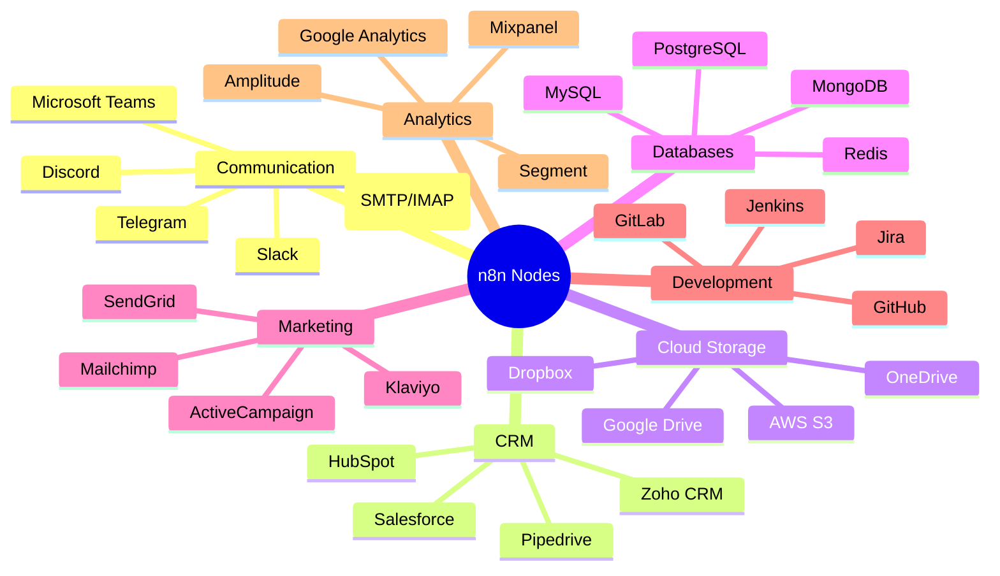
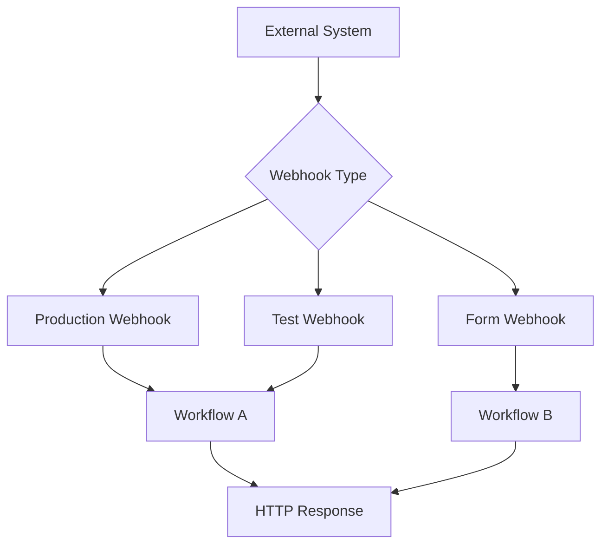
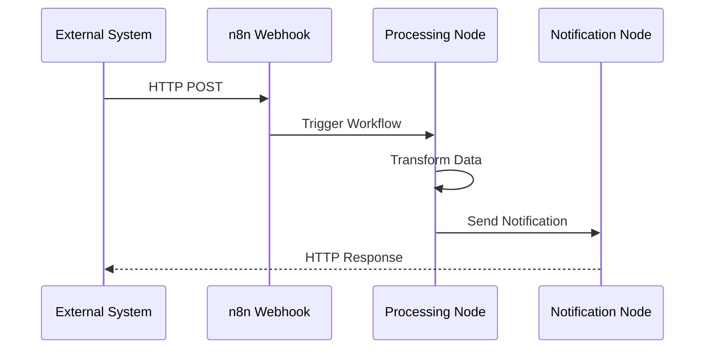

# Integrations

This document covers n8n's built-in integrations, custom node development, webhook configurations, and API connectivity patterns used in our deployment.

## Built-in Node Types

n8n provides over 400+ pre-built integrations across various categories. These nodes handle the majority of common automation scenarios.

### Node Categories



### Core Node Types

#### Trigger Nodes
Nodes that start workflow executions:

| Node | Purpose | Trigger Type | Configuration |
|------|---------|--------------|---------------|
| **Webhook** | HTTP endpoint trigger | External HTTP requests | URL, HTTP methods, authentication |
| **Cron** | Schedule-based trigger | Time-based scheduling | Cron expressions, timezone |
| **Manual Trigger** | User-initiated execution | Manual button click | Simple activation |
| **Email Trigger (IMAP)** | Email reception trigger | Incoming emails | IMAP connection, filters |
| **File Trigger** | File system changes | File creation/modification | Directory monitoring |

#### Processing Nodes
Nodes that manipulate and process data:

| Node | Purpose | Key Features |
|------|---------|--------------|
| **Set** | Data transformation | Variable assignment, data mapping |
| **Function** | Custom JavaScript | Full JavaScript environment |
| **Code** | Python/JavaScript execution | Multi-language code execution |
| **If** | Conditional branching | Boolean logic, data comparison |
| **Switch** | Multi-path routing | Multiple condition evaluation |
| **Merge** | Data combination | Array merging, data aggregation |
| **Split** | Data separation | Array splitting, batch processing |

#### Output Nodes
Nodes that send data to external systems:

| Node | Purpose | Output Format |
|------|---------|---------------|
| **HTTP Request** | API calls | REST/GraphQL requests |
| **Email** | Email sending | SMTP, HTML/text |
| **Webhook Response** | HTTP responses | JSON, XML, HTML |
| **Write File** | File creation | Various file formats |

### Popular Integration Examples

#### Slack Integration
```json
{
  "node": "Slack",
  "operation": "postMessage",
  "parameters": {
    "channel": "#alerts",
    "text": "Workflow completed successfully",
    "attachments": [
      {
        "color": "good",
        "fields": [
          {
            "title": "Execution Time",
            "value": "{{ $execution.duration }} ms"
          }
        ]
      }
    ]
  }
}
```

#### Database Query
```json
{
  "node": "PostgreSQL",
  "operation": "executeQuery",
  "parameters": {
    "query": "SELECT * FROM users WHERE created_at > $1",
    "parameters": ["{{ $node.Webhook.json.since_date }}"]
  }
}
```

#### File Processing
```json
{
  "node": "Google Drive",
  "operation": "upload",
  "parameters": {
    "name": "report_{{ $now.format('YYYY-MM-DD') }}.csv",
    "parents": ["1BxiMVs0XRA5nFMdKvBdBZjgmUUqptlbs74OgvE2upms"],
    "binaryData": true
  }
}
```

## Custom Node Development

### Node Structure

Custom nodes follow a standardized structure:

```typescript
import { INodeType, INodeTypeDescription } from 'n8n-workflow';

export class CustomNode implements INodeType {
  description: INodeTypeDescription = {
    displayName: 'Custom Node',
    name: 'customNode',
    group: ['transform'],
    version: 1,
    description: 'Custom node description',
    defaults: {
      name: 'Custom Node',
    },
    inputs: ['main'],
    outputs: ['main'],
    properties: [
      {
        displayName: 'Operation',
        name: 'operation',
        type: 'options',
        options: [
          {
            name: 'Process Data',
            value: 'processData',
          },
        ],
        default: 'processData',
      },
    ],
  };

  async execute(this: IExecuteFunctions): Promise<INodeExecutionData[][]> {
    // Custom logic implementation
    const items = this.getInputData();
    const returnData: INodeExecutionData[] = [];

    for (let i = 0; i < items.length; i++) {
      const operation = this.getNodeParameter('operation', i) as string;
      
      if (operation === 'processData') {
        // Custom processing logic
        returnData.push({
          json: {
            processed: true,
            originalData: items[i].json,
          },
        });
      }
    }

    return [returnData];
  }
}
```

### Development Workflow

**Local Development**:
```bash
# Clone n8n repository
git clone https://github.com/n8n-io/n8n.git
cd n8n

# Install dependencies
npm install

# Create custom node
mkdir packages/nodes-base/nodes/CustomNode
```

**Node Registration**:
```typescript
// packages/nodes-base/index.ts
export { CustomNode } from './nodes/CustomNode/CustomNode.node';
```

**Testing Custom Nodes**:
```typescript
// Test file structure
describe('CustomNode', () => {
  test('should process data correctly', async () => {
    const executeWorkflow = getExecuteSingleNodeFunction();
    const result = await executeWorkflow('CustomNode', {
      operation: 'processData',
    });
    
    expect(result.length).toBe(1);
    expect(result[0].processed).toBe(true);
  });
});
```

## Webhook Configurations

### Webhook Types

n8n supports different webhook configurations for various use cases:



### Production Webhooks

**Static URL Configuration**:
```bash
# Webhook URL format
https://n8n.example.com/webhook/{workflow-id}

# With custom path
https://n8n.example.com/webhook/custom-endpoint
```

**Webhook Security**:
```json
{
  "authentication": "headerAuth",
  "headerAuth": {
    "name": "X-API-Key",
    "value": "{{ $credentials.apiKey }}"
  },
  "httpMethod": "POST",
  "responseMode": "responseNode"
}
```

### Test Webhooks

**Dynamic URL Generation**:
```bash
# Test webhook URL (temporary)
https://n8n.example.com/webhook-test/{session-id}

# Regenerated on workflow save
https://n8n.example.com/webhook-test/new-session-id
```

**Use Cases**:
- Development and testing
- Temporary integrations
- Proof-of-concept workflows

### Form Webhooks

**HTML Form Integration**:
```html
<form action="https://n8n.example.com/form/contact-form" method="POST">
  <input type="text" name="name" required>
  <input type="email" name="email" required>
  <textarea name="message" required></textarea>
  <button type="submit">Submit</button>
</form>
```

**Form Processing**:
```json
{
  "node": "Webhook",
  "webhook": {
    "httpMethod": "POST",
    "path": "contact-form",
    "responseMode": "responseNode"
  },
  "processing": {
    "validation": true,
    "sanitization": true,
    "redirectUrl": "/thank-you"
  }
}
```

## API Connectivity

### REST API Integration

**HTTP Request Node Configuration**:
```json
{
  "node": "HTTP Request",
  "parameters": {
    "url": "https://api.example.com/v1/users",
    "authentication": "genericCredentialType",
    "method": "GET",
    "headers": {
      "Accept": "application/json",
      "User-Agent": "n8n-workflow"
    },
    "qs": {
      "page": "{{ $node.Webhook.json.page }}",
      "limit": 50
    }
  }
}
```

**Error Handling**:
```json
{
  "continueOnFail": true,
  "retryOnFail": true,
  "retryCount": 3,
  "retryInterval": 1000,
  "errorHandling": {
    "4xx": "continue",
    "5xx": "retry",
    "timeout": "retry"
  }
}
```

### GraphQL Integration

**GraphQL Query Example**:
```json
{
  "node": "HTTP Request",
  "parameters": {
    "url": "https://api.example.com/graphql",
    "method": "POST",
    "headers": {
      "Content-Type": "application/json",
      "Authorization": "Bearer {{ $credentials.token }}"
    },
    "body": {
      "query": "query GetUsers($limit: Int) { users(limit: $limit) { id name email } }",
      "variables": {
        "limit": 10
      }
    }
  }
}
```

### Rate Limiting and Throttling

**Request Throttling**:
```json
{
  "node": "Wait",
  "parameters": {
    "amount": 1,
    "unit": "seconds"
  },
  "description": "Rate limiting for API calls"
}
```

**Batch Processing**:
```json
{
  "node": "Split In Batches",
  "parameters": {
    "batchSize": 10,
    "options": {
      "reset": false
    }
  }
}
```

## Authentication Methods

### Supported Authentication Types

| Method | Use Case | Configuration |
|--------|----------|---------------|
| **No Auth** | Public APIs | No credentials required |
| **Basic Auth** | Simple username/password | Username and password |
| **Header Auth** | API key in header | Header name and value |
| **OAuth1** | Legacy OAuth | Consumer key/secret, tokens |
| **OAuth2** | Modern OAuth | Client ID/secret, scopes |
| **JWT** | Token-based auth | Token and optional refresh |

### OAuth2 Configuration

**Google OAuth Example**:
```json
{
  "credentialType": "googleOAuth2Api",
  "clientId": "{{ $env.GOOGLE_CLIENT_ID }}",
  "clientSecret": "{{ $env.GOOGLE_CLIENT_SECRET }}",
  "scope": [
    "https://www.googleapis.com/auth/drive",
    "https://www.googleapis.com/auth/spreadsheets"
  ],
  "authUrl": "https://accounts.google.com/o/oauth2/auth",
  "tokenUrl": "https://oauth2.googleapis.com/token"
}
```

### API Key Management

**Environment Variable Pattern**:
```bash
# Store API keys as environment variables
API_KEY_SALESFORCE=your_salesforce_api_key
API_KEY_SLACK=your_slack_bot_token
API_KEY_GITHUB=your_github_personal_access_token
```

**Credential Node Usage**:
```json
{
  "node": "HTTP Request",
  "authentication": "predefinedCredentialType",
  "nodeCredentialType": "salesforceApi",
  "credentials": {
    "salesforceApi": {
      "apiKey": "{{ $credentials.apiKey }}",
      "instanceUrl": "{{ $credentials.instanceUrl }}"
    }
  }
}
```

## Integration Patterns

### Event-Driven Workflows

**Webhook → Process → Notify Pattern**:


### Data Synchronization

**Bi-directional Sync Pattern**:
```json
{
  "workflow": "CRM Sync",
  "schedule": "0 */6 * * *",
  "steps": [
    {
      "node": "Salesforce",
      "operation": "getUpdatedRecords",
      "since": "{{ $execution.lastSuccessfulRun }}"
    },
    {
      "node": "HTTP Request",
      "operation": "updateLocalDatabase"
    },
    {
      "node": "Local Database",
      "operation": "getUpdatedRecords"
    },
    {
      "node": "Salesforce",
      "operation": "updateRecords"
    }
  ]
}
```

### Error Handling and Retry

**Robust Integration Pattern**:
```json
{
  "errorWorkflow": {
    "enabled": true,
    "workflowId": "error-handler-workflow"
  },
  "retrySettings": {
    "enabled": true,
    "maxRetries": 3,
    "retryInterval": "exponential",
    "baseDelay": 1000
  },
  "fallback": {
    "node": "Send Alert",
    "operation": "notifyAdministrator"
  }
}
```

## Performance Optimization

### Bulk Operations

**Batch Processing Configuration**:
```json
{
  "node": "Split In Batches",
  "parameters": {
    "batchSize": 100,
    "options": {
      "reset": false
    }
  },
  "description": "Process 100 records at a time"
}
```

### Caching Strategies

**Response Caching**:
```json
{
  "node": "Function",
  "code": `
    // Simple in-memory cache
    if (global.cache && global.cache[cacheKey]) {
      return global.cache[cacheKey];
    }
    
    // Fetch data if not cached
    const data = await fetchData();
    
    // Cache for 5 minutes
    global.cache = global.cache || {};
    global.cache[cacheKey] = data;
    setTimeout(() => delete global.cache[cacheKey], 300000);
    
    return data;
  `
}
```

### Connection Pooling

**Database Connection Optimization**:
```json
{
  "credentials": {
    "postgres": {
      "host": "postgres.example.com",
      "database": "production",
      "username": "n8n_user",
      "password": "secure_password",
      "ssl": true,
      "pool": {
        "min": 2,
        "max": 10,
        "idle": 10000
      }
    }
  }
}
```

## Monitoring and Observability

### Integration Health Checks

**Webhook Health Check**:
```bash
# Test webhook endpoint
curl -X POST \
  https://n8n.example.com/webhook/health-check \
  -H "Content-Type: application/json" \
  -d '{"test": true}'
```

**API Integration Monitoring**:
```json
{
  "workflow": "API Health Check",
  "schedule": "*/5 * * * *",
  "nodes": [
    {
      "name": "Test External APIs",
      "type": "HTTP Request",
      "url": "https://api.external.com/health"
    },
    {
      "name": "Log Results",
      "type": "Function",
      "code": "console.log('API Status:', $json.status);"
    }
  ]
}
```

### Error Tracking

**Integration Error Workflow**:
```json
{
  "errorWorkflow": {
    "name": "Integration Error Handler",
    "nodes": [
      {
        "name": "Log Error",
        "type": "Function",
        "code": "console.error('Integration failed:', $error);"
      },
      {
        "name": "Send Alert",
        "type": "Slack",
        "channel": "#alerts",
        "message": "Integration error: {{ $error.message }}"
      }
    ]
  }
}
```

## Seams

For comprehensive integration guidance, refer to official resources:

- [n8n Nodes Documentation](https://docs.n8n.io/nodes/) — Complete node reference and examples
- [n8n Webhook Guide](https://docs.n8n.io/webhooks/) — Webhook configuration and security
- [n8n Custom Nodes](https://docs.n8n.io/nodes/creating-nodes/) — Custom node development guide
- [n8n API Reference](https://docs.n8n.io/api/) — REST API documentation
- [n8n Community Nodes](https://www.npmjs.com/search?q=n8n-nodes) — Third-party node packages

## Source Map

| Title | URL | Publisher | Last_Updated | Date_Accessed |
|-------|-----|-----------|--------------|---------------|
| n8n Nodes Documentation | https://docs.n8n.io/nodes/ | n8n GmbH | 2024-09-10 | 2024-09-17 |
| n8n Webhook Guide | https://docs.n8n.io/webhooks/ | n8n GmbH | 2024-08-25 | 2024-09-17 |
| n8n Custom Node Development | https://docs.n8n.io/nodes/creating-nodes/ | n8n GmbH | 2024-08-15 | 2024-09-17 |
| n8n API Reference | https://docs.n8n.io/api/ | n8n GmbH | 2024-09-05 | 2024-09-17 |
| n8n Community Forum | https://community.n8n.io/ | n8n Community | 2024-09-16 | 2024-09-17 |

**Last reviewed**: 2024-09-17