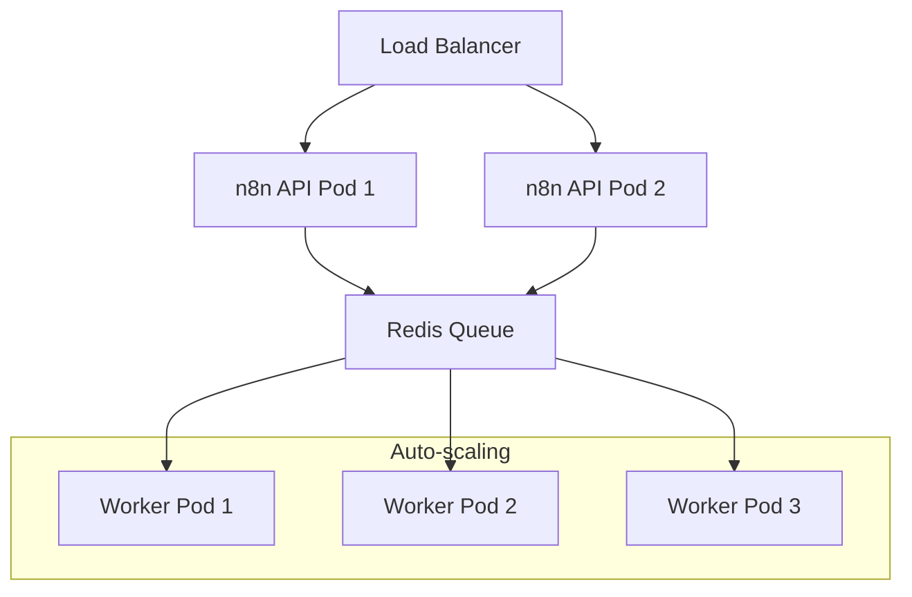

# Operations

This guide covers operational procedures for deploying, monitoring, scaling, and maintaining n8n in production environments.

## Deployment Methods

### Docker Deployment

The recommended approach for production deployments uses Docker containers:

```bash
# Basic single-instance deployment
docker run -d \
  --name n8n \
  -p 5678:5678 \
  -v n8n_data:/home/node/.n8n \
  -e DB_TYPE=postgresdb \
  -e DB_POSTGRESDB_HOST=postgres \
  -e DB_POSTGRESDB_DATABASE=n8n \
  -e DB_POSTGRESDB_USER=n8n \
  -e DB_POSTGRESDB_PASSWORD=n8n \
  n8nio/n8n
```

**Key Configuration Options:**
- **Database**: PostgreSQL recommended for production
- **Volumes**: Persistent storage for workflows and user data
- **Environment Variables**: Configuration through environment variables
- **Networking**: Expose appropriate ports for web UI and webhooks

### Docker Compose

For multi-service deployments with dependencies:

```yaml
# Reference our docker-compose.yml for complete configuration
version: '3.8'
services:
  n8n:
    image: n8nio/n8n:latest
    ports:
      - "5678:5678"
    environment:
      - DB_TYPE=postgresdb
      - DB_POSTGRESDB_HOST=postgres
    depends_on:
      - postgres
  
  postgres:
    image: postgres:13
    environment:
      - POSTGRES_DB=n8n
```

### Kubernetes Deployment

For scalable, production-ready deployments using our Helm chart:

```bash
# Deploy using our Helm chart
helm install n8n ./ops/helm/n8n \
  --set postgresql.enabled=true \
  --set redis.enabled=true \
  --set scaling.enabled=true
```

**Helm Chart Features:**
- **High Availability**: Multiple API and worker pods
- **Autoscaling**: Horizontal Pod Autoscaler integration
- **Monitoring**: Prometheus metrics and Grafana dashboards
- **Security**: Pod Security Standards and Network Policies

## Configuration Management

### Environment Variables

Critical configuration parameters:

| Variable | Purpose | Example | Required |
|----------|---------|---------|----------|
| `N8N_HOST` | Webhook hostname | `n8n.example.com` | Yes |
| `N8N_PORT` | Application port | `5678` | No |
| `N8N_PROTOCOL` | Protocol for webhooks | `https` | Yes |
| `DB_TYPE` | Database type | `postgresdb` | Yes |
| `WEBHOOK_URL` | Base webhook URL | `https://n8n.example.com/` | Yes |

### Secrets Management

Using our SOPS/age encryption workflow:

```bash
# Create secrets configuration
cat > ops/secrets/n8n-secrets/values.dec.yaml << EOF
database:
  password: "secure_db_password"
  
encryption:
  key: "32_character_encryption_key"
  
oauth:
  google_client_secret: "oauth_secret"
EOF

# Encrypt secrets
make encrypt-secrets SECRETS_DIR=./ops/secrets/n8n-secrets
```

### Database Configuration

**PostgreSQL (Recommended)**:
```bash
# Connection configuration
DB_TYPE=postgresdb
DB_POSTGRESDB_HOST=postgres.example.com
DB_POSTGRESDB_PORT=5432
DB_POSTGRESDB_DATABASE=n8n
DB_POSTGRESDB_USER=n8n
DB_POSTGRESDB_PASSWORD_FILE=/run/secrets/db_password
```

**High Availability Setup**:
- Read replicas for improved performance
- Connection pooling (PgBouncer recommended)
- Regular backups and point-in-time recovery

## Scaling Strategies

### Horizontal Scaling

n8n supports scaling through queue-based worker architecture:



**Scaling Configuration**:
```yaml
# Kubernetes HPA example
apiVersion: autoscaling/v2
kind: HorizontalPodAutoscaler
metadata:
  name: n8n-workers
spec:
  scaleTargetRef:
    apiVersion: apps/v1
    kind: Deployment
    name: n8n-workers
  minReplicas: 2
  maxReplicas: 10
  metrics:
  - type: Resource
    resource:
      name: cpu
      target:
        type: Utilization
        averageUtilization: 70
```

### Performance Optimization

**Database Optimization**:
- Enable connection pooling
- Optimize PostgreSQL configuration for workload
- Regular VACUUM and ANALYZE operations
- Index optimization for frequently queried data

**Application Optimization**:
- Configure appropriate worker concurrency
- Tune Node.js garbage collection settings
- Implement caching for frequently accessed data
- Monitor memory usage and optimize node execution

## Monitoring and Observability

### Health Checks

n8n provides built-in health check endpoints:

```bash
# Application health
curl http://localhost:5678/healthz

# Database connection
curl http://localhost:5678/healthz/db
```

### Metrics Collection

**Prometheus Integration**:
```yaml
# Enable metrics in n8n configuration
N8N_METRICS=true
N8N_METRICS_PREFIX=n8n_

# Metrics endpoint
GET /metrics
```

**Key Metrics to Monitor**:
- Workflow execution count and duration
- API response times and error rates
- Database connection pool utilization
- Worker queue length and processing time
- Memory and CPU utilization

### Logging

**Structured Logging Configuration**:
```bash
# Enable JSON logging
N8N_LOG_LEVEL=info
N8N_LOG_OUTPUT=json
N8N_LOG_FILE=/var/log/n8n/n8n.log
```

**Log Aggregation**:
- Centralized logging with ELK Stack or similar
- Log rotation and retention policies
- Error alerting and notification

## Backup and Recovery

### Database Backups

**Automated PostgreSQL Backups**:
```bash
# Daily backup script
pg_dump -h $DB_HOST -U $DB_USER -d $DB_NAME \
  --verbose --clean --no-owner --no-privileges \
  --file="/backup/n8n-$(date +%Y%m%d).sql"
```

**Backup Strategy**:
- Daily full backups with 30-day retention
- Point-in-time recovery capability
- Cross-region backup replication
- Regular restore testing

### Data Recovery Procedures

**Workflow Recovery**:
1. Stop n8n application
2. Restore database from backup
3. Verify data integrity
4. Restart application
5. Test critical workflows

**Disaster Recovery**:
- RPO: 1 hour (database backups)
- RTO: 30 minutes (application restart)
- Geographic redundancy for critical data

## Security Operations

### Access Control

**User Management**:
- Role-based access control (RBAC)
- Regular access reviews and cleanup
- Strong password policies
- Multi-factor authentication (MFA) when available

**Network Security**:
- TLS/SSL termination at load balancer
- Internal service mesh for component communication
- Network policies restricting pod-to-pod communication
- Regular security scanning and vulnerability assessment

### Credential Management

**Best Practices**:
- Rotate credentials regularly (quarterly)
- Use service accounts for automation
- Encrypt credentials at rest
- Audit credential usage and access

## Maintenance Procedures

### Routine Maintenance

**Weekly Tasks**:
- Review application logs for errors
- Check disk space and performance metrics
- Verify backup completion and integrity
- Update security patches if available

**Monthly Tasks**:
- Database maintenance (VACUUM, ANALYZE)
- Review and cleanup old execution data
- Capacity planning and resource utilization review
- Security audit and access review

### Upgrade Procedures

**n8n Version Upgrades**:
1. Review release notes and breaking changes
2. Test upgrade in staging environment
3. Schedule maintenance window
4. Backup current system state
5. Perform rolling upgrade
6. Validate functionality post-upgrade
7. Monitor for issues during rollout period

**Database Schema Migrations**:
- Automatic migrations handled by n8n
- Manual backup before major version upgrades
- Rollback procedures documented and tested

## Troubleshooting

### Common Issues

**Application Won't Start**:
- Check database connectivity
- Verify environment variable configuration
- Review application logs for specific errors
- Validate secrets and credential access

**Performance Issues**:
- Monitor database query performance
- Check worker queue backlog
- Review memory and CPU utilization
- Analyze slow workflow executions

**Webhook Issues**:
- Verify DNS and SSL certificate configuration
- Check firewall and load balancer settings
- Validate webhook URL configuration
- Test external connectivity

## Seams

For comprehensive operational guidance, refer to official documentation:

- [n8n Installation Guide](https://docs.n8n.io/hosting/installation/) — Complete deployment instructions
- [n8n Configuration Reference](https://docs.n8n.io/hosting/configuration/) — Environment variables and settings
- [n8n Scaling Guide](https://docs.n8n.io/hosting/scaling/) — Performance optimization and scaling
- [n8n Docker Hub](https://hub.docker.com/r/n8nio/n8n) — Official container images and deployment notes
- [n8n Helm Chart](https://artifacthub.io/packages/helm/n8n-io/n8n) — Kubernetes deployment configuration

## Source Map

| Title | URL | Publisher | Last_Updated | Date_Accessed |
|-------|-----|-----------|--------------|---------------|
| n8n Installation Guide | https://docs.n8n.io/hosting/installation/ | n8n GmbH | 2024-08-20 | 2024-09-17 |
| n8n Configuration Reference | https://docs.n8n.io/hosting/configuration/ | n8n GmbH | 2024-08-15 | 2024-09-17 |
| n8n Scaling Documentation | https://docs.n8n.io/hosting/scaling/ | n8n GmbH | 2024-07-30 | 2024-09-17 |
| n8n Docker Images | https://hub.docker.com/r/n8nio/n8n | n8n GmbH | 2024-09-11 | 2024-09-17 |
| n8n Helm Chart | https://artifacthub.io/packages/helm/n8n-io/n8n | Artifact Hub | 2024-09-10 | 2024-09-17 |

**Last reviewed**: 2024-09-17