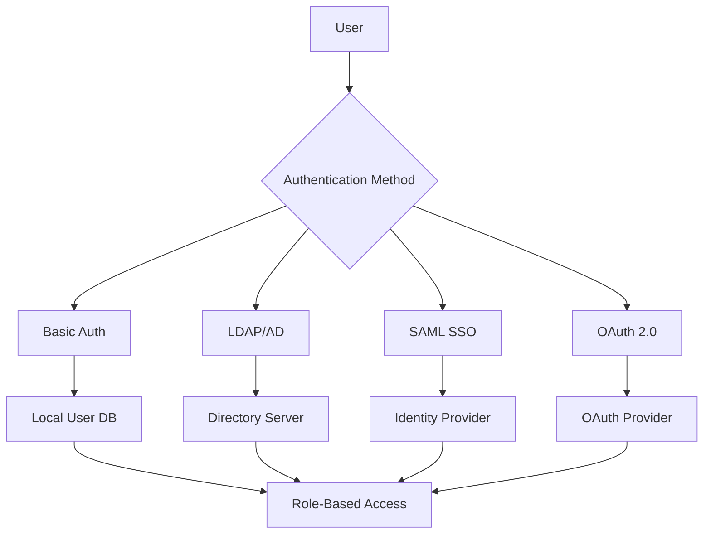

# Security

This document outlines security considerations, authentication methods, and hardening procedures for n8n deployments in our infrastructure.

## Authentication and Authorization

### User Management

n8n supports multiple authentication methods depending on the deployment type:



### Basic Authentication

**Default Configuration**:
```bash
# Environment variables for basic auth
N8N_BASIC_AUTH_ACTIVE=true
N8N_BASIC_AUTH_USER=admin
N8N_BASIC_AUTH_PASSWORD_FILE=/run/secrets/admin_password
```

**User Registration**:
- Self-registration can be disabled for security
- Admin-controlled user provisioning
- Password complexity requirements

### LDAP/Active Directory Integration

**Configuration Example**:
```bash
# LDAP authentication settings
N8N_USER_MANAGEMENT_LDAP_ENABLED=true
N8N_USER_MANAGEMENT_LDAP_SERVER_URL=ldaps://ldap.example.com:636
N8N_USER_MANAGEMENT_LDAP_BASE_DN=dc=example,dc=com
N8N_USER_MANAGEMENT_LDAP_BIND_DN=cn=n8n,ou=services,dc=example,dc=com
N8N_USER_MANAGEMENT_LDAP_BIND_PASSWORD_FILE=/run/secrets/ldap_password
```

**Security Considerations**:
- Use LDAPS (LDAP over SSL) for encrypted connections
- Service account with minimal required permissions
- Certificate validation for LDAP server connections
- Regular credential rotation

### SAML Single Sign-On

**Enterprise Feature Configuration**:
```bash
# SAML SSO settings (Enterprise Edition)
N8N_SSO_SAML_ENABLED=true
N8N_SSO_SAML_METADATA_URL=https://idp.example.com/metadata
N8N_SSO_SAML_ENTITY_ID=n8n.example.com
N8N_SSO_SAML_RETURN_URL=https://n8n.example.com/rest/sso/saml/initsso
```

**Security Requirements**:
- Certificate-based SAML assertion signing
- Encrypted SAML assertions
- Attribute mapping for user roles
- Session timeout configuration

### Role-Based Access Control (RBAC)

**Default Roles**:
- **Owner**: Full administrative access
- **Admin**: User management and system configuration
- **Member**: Workflow creation and execution
- **Viewer**: Read-only access to workflows

**Permission Matrix**:

| Action | Owner | Admin | Member | Viewer |
|--------|-------|-------|--------|--------|
| Create workflows | ✅ | ✅ | ✅ | ❌ |
| Execute workflows | ✅ | ✅ | ✅ | ❌ |
| View workflows | ✅ | ✅ | ✅ | ✅ |
| Manage users | ✅ | ✅ | ❌ | ❌ |
| System settings | ✅ | ❌ | ❌ | ❌ |
| Credential management | ✅ | ✅ | ✅ | ❌ |

## Credential Management

### Encryption at Rest

n8n encrypts sensitive data using AES-256-GCM:

```bash
# Encryption configuration
N8N_ENCRYPTION_KEY_FILE=/run/secrets/encryption_key

# Generate secure encryption key
openssl rand -hex 32 > encryption_key
```

**Key Management**:
- 256-bit encryption keys
- Key rotation procedures
- Secure key storage (Kubernetes secrets, HashiCorp Vault)
- Backup encryption keys separately

### External Credential Storage

**HashiCorp Vault Integration**:
```bash
# Vault configuration
N8N_EXTERNAL_SECRETS_VAULT_ENABLED=true
N8N_EXTERNAL_SECRETS_VAULT_URL=https://vault.example.com
N8N_EXTERNAL_SECRETS_VAULT_AUTH_METHOD=token
N8N_EXTERNAL_SECRETS_VAULT_TOKEN_FILE=/run/secrets/vault_token
```

**Benefits**:
- Centralized credential management
- Audit trails for credential access
- Dynamic secret generation
- Fine-grained access policies

### Credential Scoping

**Best Practices**:
- Scope credentials to specific workflows or users
- Regular credential rotation (quarterly)
- Audit credential usage
- Disable unused credentials

## Network Security

### TLS/SSL Configuration

**HTTPS Enforcement**:
```bash
# Force HTTPS
N8N_PROTOCOL=https
N8N_SSL_KEY=/etc/ssl/private/n8n.key
N8N_SSL_CERT=/etc/ssl/certs/n8n.crt
```

**Certificate Management**:
- Use certificates from trusted CA
- Implement certificate rotation
- Monitor certificate expiration
- Strong cipher suites only

### Network Policies

**Kubernetes Network Policies**:
```yaml
apiVersion: networking.k8s.io/v1
kind: NetworkPolicy
metadata:
  name: n8n-network-policy
spec:
  podSelector:
    matchLabels:
      app: n8n
  policyTypes:
  - Ingress
  - Egress
  ingress:
  - from:
    - namespaceSelector:
        matchLabels:
          name: ingress-system
    ports:
    - protocol: TCP
      port: 5678
  egress:
  - to: []
    ports:
    - protocol: TCP
      port: 443  # HTTPS
    - protocol: TCP
      port: 5432  # PostgreSQL
```

### Firewall Configuration

**Recommended Port Access**:
- **5678**: n8n web interface (HTTPS only)
- **5432**: PostgreSQL (internal only)
- **6379**: Redis (internal only)
- **443**: Outbound HTTPS for integrations

## Security Hardening

### Container Security

**Docker Security Best Practices**:
```dockerfile
# Use non-root user
USER node

# Read-only root filesystem
--read-only --tmpfs /tmp

# Drop capabilities
--cap-drop=ALL

# Security options
--security-opt=no-new-privileges:true
```

**Image Scanning**:
```bash
# Scan for vulnerabilities
trivy image n8nio/n8n:latest

# Generate SBOM
syft n8nio/n8n:latest -o spdx-json
```

### Kubernetes Security

**Pod Security Standards**:
```yaml
apiVersion: v1
kind: Pod
metadata:
  name: n8n
  annotations:
    container.apparmor.security.beta.kubernetes.io/n8n: runtime/default
spec:
  securityContext:
    runAsNonRoot: true
    runAsUser: 1000
    fsGroup: 1000
    seccompProfile:
      type: RuntimeDefault
  containers:
  - name: n8n
    securityContext:
      allowPrivilegeEscalation: false
      readOnlyRootFilesystem: true
      capabilities:
        drop:
        - ALL
```

### Environment Hardening

**System Configuration**:
- Disable unnecessary services
- Regular security updates
- File system permissions
- Audit logging enabled
- Fail2ban for brute force protection

**Application Hardening**:
```bash
# Security headers
N8N_SECURITY_AUDIT_ON_POST_WORKFLOW_EXECUTE=true
N8N_LOG_LEVEL=info  # Avoid debug in production
N8N_HIDE_USAGE_PAGE=true
N8N_DIAGNOSTICS_ENABLED=false
```

## Compliance and Auditing

### Audit Logging

**Enable Comprehensive Logging**:
```bash
# Audit configuration
N8N_LOG_LEVEL=info
N8N_LOG_FILE=/var/log/n8n/audit.log
N8N_LOG_OUTPUT=json
```

**Audit Events**:
- User authentication attempts
- Workflow creation/modification
- Credential access
- System configuration changes
- Failed authorization attempts

### Data Protection

**GDPR Compliance**:
- Data minimization in workflows
- Right to erasure implementation
- Data portability features
- Consent management integration
- Privacy impact assessments

**Data Classification**:
- **Public**: Non-sensitive workflow templates
- **Internal**: Business logic and configurations
- **Confidential**: Customer data and credentials
- **Restricted**: Authentication tokens and encryption keys

### Monitoring and Alerting

**Security Monitoring**:
```yaml
# Prometheus alerting rules
groups:
- name: n8n-security
  rules:
  - alert: HighAuthFailureRate
    expr: rate(n8n_auth_failures_total[5m]) > 0.1
    for: 2m
    annotations:
      summary: High authentication failure rate detected
  
  - alert: UnauthorizedWorkflowAccess
    expr: increase(n8n_unauthorized_access_total[1h]) > 0
    annotations:
      summary: Unauthorized workflow access attempt
```

## Vulnerability Management

### Security Advisories

**Monitoring Sources**:
- [n8n Security Advisories](https://github.com/n8n-io/n8n/security/advisories)
- CVE databases for dependencies
- Node.js security announcements
- Container base image updates

**Recent Security Issues**:
- **CVE-2024-XXXX**: Prototype Pollution vulnerability (fixed in v1.27.0)
- **CVE-2024-YYYY**: Stored XSS in workflow descriptions (fixed in v1.25.3)

### Patch Management

**Update Process**:
1. Monitor security advisories
2. Test patches in staging environment
3. Schedule maintenance windows
4. Apply updates with rollback plan
5. Verify security improvements
6. Document changes and lessons learned

**Emergency Patching**:
- Critical vulnerabilities: 24-hour response
- High severity: 72-hour response
- Medium/Low: Next scheduled maintenance

## Incident Response

### Security Incident Categories

**Category 1 - Critical**:
- Data breach or unauthorized access
- Complete system compromise
- Credential exposure

**Category 2 - High**:
- Privilege escalation
- Service disruption due to security issue
- Malware detection

**Category 3 - Medium**:
- Unauthorized access attempts
- Configuration vulnerabilities
- Non-critical data exposure

### Response Procedures

**Immediate Actions**:
1. Isolate affected systems
2. Preserve evidence
3. Notify security team
4. Begin containment procedures
5. Document timeline and actions

**Communication Plan**:
- Internal stakeholder notification
- Customer communication (if applicable)
- Regulatory reporting (if required)
- Post-incident review and improvements

## Seams

For comprehensive security guidance, refer to authoritative sources:

- [n8n Security Best Practices](https://docs.n8n.io/hosting/security/) — Official security recommendations
- [n8n User Management](https://docs.n8n.io/user-management/) — Authentication and authorization guide
- [n8n Security Advisories](https://github.com/n8n-io/n8n/security/advisories) — Current security issues and patches
- [OWASP Top 10](https://owasp.org/www-project-top-ten/) — Web application security risks
- [CIS Kubernetes Benchmark](https://www.cisecurity.org/benchmark/kubernetes) — Kubernetes security standards

## Source Map

| Title | URL | Publisher | Last_Updated | Date_Accessed |
|-------|-----|-----------|--------------|---------------|
| n8n Security Best Practices | https://docs.n8n.io/hosting/security/ | n8n GmbH | 2024-08-25 | 2024-09-17 |
| n8n User Management | https://docs.n8n.io/user-management/ | n8n GmbH | 2024-09-01 | 2024-09-17 |
| n8n Security Advisories | https://github.com/n8n-io/n8n/security/advisories | n8n GmbH | 2024-09-10 | 2024-09-17 |
| OWASP Top 10 | https://owasp.org/www-project-top-ten/ | OWASP Foundation | 2024-06-15 | 2024-09-17 |
| CIS Kubernetes Benchmark | https://www.cisecurity.org/benchmark/kubernetes | CIS | 2024-07-01 | 2024-09-17 |

**Last reviewed**: 2024-09-17